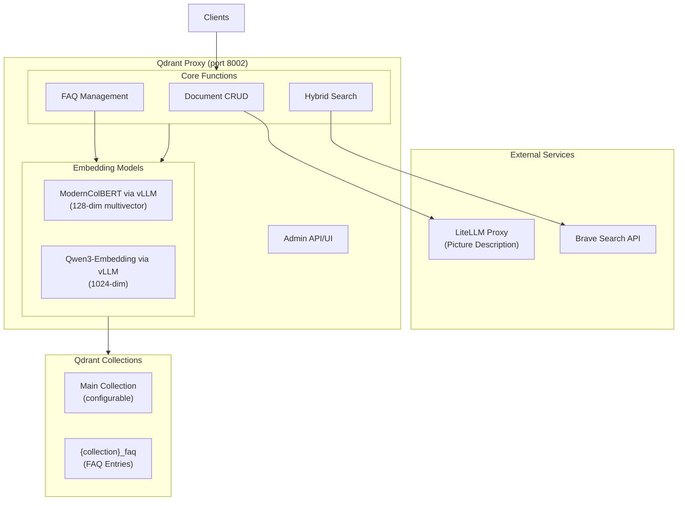

# Architecture & File Tree

## Architecture Overview



## File Tree

```
services/qdrant-proxy/
├── app.py                      # FastAPI main application (~2k lines)
├── config.py                   # Pydantic Settings for all env vars
├── state.py                    # Application state (clients, models)
├── auth.py                     # Admin authentication utilities
├── requirements.txt            # Python dependencies
├── .env.example                # Environment variable reference
├── docs/                       # Documentation (this folder)
│   ├── README.md               # Index & project overview
│   ├── architecture.md         # Architecture & file tree (this file)
│   ├── search-pipeline.md      # Dual-vector search strategy
│   ├── api-reference.md        # REST endpoint documentation
│   ├── mcp-tools.md            # MCP tool definitions & usage
│   ├── faq-knowledge-base.md   # FAQ entries, KV store, extraction
│   ├── maintenance.md          # Re-embedding, templates, GC
│   ├── feedback-system.md      # Search quality feedback & export
│   └── configuration.md        # Env vars, dependencies, deployment
├── admin-ui/                   # React + Vite admin SPA
│   ├── package.json            # Node dependencies & build scripts
│   ├── vite.config.ts          # Vite config (base: /admin/)
│   ├── tsconfig.json           # TypeScript config
│   ├── index.html              # HTML entry point (loads Tailwind CDN)
│   └── src/
│       ├── main.tsx            # React entry point
│       ├── App.tsx             # Root component (login gate)
│       ├── store.tsx           # Global state (auth, collection, stats)
│       ├── types.ts            # TypeScript interfaces
│       ├── utils.ts            # Helpers (entity badges, timeAgo, UUID)
│       ├── index.css           # Custom styles (tabs, buttons, badges)
│       ├── api/
│       │   ├── client.ts       # REST client with admin key auth
│       │   └── mcp.ts          # MCP Streamable HTTP client
│       └── components/
│           ├── Layout.tsx      # Header + tab navigation
│           ├── LoginScreen.tsx # API key login form
│           ├── SearchTab.tsx   # KB search, web search, URL fetch
│           ├── FaqTab.tsx      # FAQ/KV CRUD + semantic search
│           ├── QualityTab.tsx  # Search & FAQ quality feedback
│           ├── MaintenanceTab.tsx # Embedding info, re-embed, templates
│           └── ui.tsx          # Shared: Modal, Spinner, FAQEntryDisplay, StarRating
├── models/                     # Pydantic request/response models
│   ├── __init__.py             # Re-exports all models
│   ├── requests.py             # API request models
│   ├── responses.py            # API response models
│   └── admin.py                # Admin-specific models
├── services/                   # Business logic services
│   ├── __init__.py             # Re-exports all services
│   ├── embedding.py            # ColBERT, Dense encoding
│   ├── docling.py              # URL scraping and file conversion
│   ├── brave_search.py         # Brave Search API + background ingestion
│   ├── hybrid_search.py        # Shared hybrid search helpers (prefetch + FAQ search)
│   ├── qdrant_ops.py           # Collection ops, feedback collection helpers
│   ├── facts.py                # FAQ helper utilities
│   ├── kv.py                   # FAQ / Key-Value CRUD and search
│   ├── system_config.py        # Persistent model config in Qdrant
│   └── template_learning.py    # Domain boilerplate template learning
├── routes/                     # API route handlers
│   ├── __init__.py             # Router aggregation
│   ├── search.py               # Hybrid search, OpenWebUI search, scroll
│   ├── kv.py                   # FAQ / KV REST endpoints
│   └── admin/                  # Admin-specific routes
│       ├── core.py             # Admin stats + UI serving
│       ├── documents.py        # Admin document management
│       ├── facts.py            # FAQ entry listing
│       ├── feedback.py         # Search & FAQ quality feedback
│       ├── maintenance.py      # Re-embedding + model config
│       └── templates.py        # Domain boilerplate template management
└── knowledge_graph/            # FAQ knowledge base subsystem
    ├── __init__.py             # Package exports
    └── models.py               # Pydantic models for FAQ entries
```

## Module Responsibilities

| Module | Purpose |
|--------|---------|
| `config.py` | Pydantic Settings class loading all env vars (`settings` singleton) |
| `state.py` | AppState class holding Qdrant client and models |
| `auth.py` | `verify_admin_auth()` dependency for admin endpoints |
| `models/` | All Pydantic request/response models (extracted from app.py) |
| `services/embedding.py` | `encode_query()`, `encode_document()`, `encode_documents_batch()`, `encode_dense()`, `encode_dense_batch()` |
| `services/docling.py` | Native Docling integration: `scrape_url_with_docling()` → `DoclingResult`, `convert_file_with_docling()`, `extract_all_hyperlinks()`, `extract_docling_layout()`, `extract_docling_title()` |
| `services/brave_search.py` | `call_brave_search()`, `process_web_search_results()`, `set_upsert_document_func()` |
| `services/qdrant_ops.py` | `ensure_collection()`, `ensure_faq_collection()`, `ensure_feedback_collection()`, collection naming helpers |
| `services/facts.py` | `generate_faq_text()`, `generate_faq_id()`, `build_faq_response_from_payload()`, `url_to_doc_id()`, `transform_scores_for_contrast()`, `extract_title_from_markdown()`, `parse_source_documents()` |
| `services/hybrid_search.py` | `build_hybrid_prefetch()` (dense prefetch list), `search_faqs()` (unified FAQ search), `FAQ_MIN_SCORE` constant |
| `services/kv.py` | `ensure_kv_collection()`, `upsert_kv()`, `list_kv()`, `get_kv()`, `delete_kv()`, `search_kv()`, `find_kv_by_key()`, `get_kv_collection_name()` |
| `services/system_config.py` | Persistent embedding model configuration stored in Qdrant (`system_config` collection) |
| `services/template_learning.py` | `compute_content_fingerprints()`, `filter_boilerplate()`, `build_domain_template()`, `load_domain_template()`, `preview_domain_template()`, `reapply_domain_template()`, `list_collection_domains()`, `extract_domain()` |
| `knowledge_graph/models.py` | `SourceDocument`, `FAQResponse`, `SearchFeedbackCreate`, `FeedbackResponse`, `FeedbackStatsResponse`, `FeedbackExportResponse` |
| `routes/search.py` | `/search`, `/openwebui/search`, `/collections/{name}/scroll` endpoints |
| `routes/kv.py` | KV REST endpoints (`/kv/...`) |
| `routes/admin/core.py` | Admin stats + React SPA serving (falls back to legacy HTML) |
| `routes/admin/documents.py` | Admin document list, details, re-extract |
| `routes/admin/facts.py` | FAQ entry listing |
| `routes/admin/feedback.py` | Search feedback endpoints |
| `routes/admin/maintenance.py` | Blue-green re-embedding migration, finalize-migration alias swap, model config |
| `routes/admin/templates.py` | Domain boilerplate template management |

## Code Organization

The codebase uses a modular package structure with centralized configuration:

- **Configuration**: All settings via `config.py` Pydantic Settings (`settings.*`)
- **State Management**: Shared state via `state.py` AppState (`get_app_state()`)
- **Business Logic**: Isolated services in `services/` package
- **Route Handlers**: Split across `routes/` and remaining in `app.py`
- **Data Models**: Pydantic models in `models/` and `knowledge_graph/models.py`

Remaining endpoints in `app.py` (~2k lines):
- Document CRUD endpoints
- Admin endpoints
- FAQ knowledge base endpoints (MCP tools)
- MCP tool definitions

## Collection Naming Conventions

| Pattern | Purpose |
|---------|---------|
| `{name}` | Main document collection |
| `{name}_faq` | FAQ entries for a document collection |
| `kv_{collection_name}` | FAQ / Key-Value entries |
| `{name}_feedback` | Search quality feedback |
| `{name}_migration_{timestamp}` | Temporary collection during re-embedding |
| `__domain_template__{domain}` | Domain boilerplate template (special doc in main collection) |
| `system_config` | Persistent embedding model configuration |
