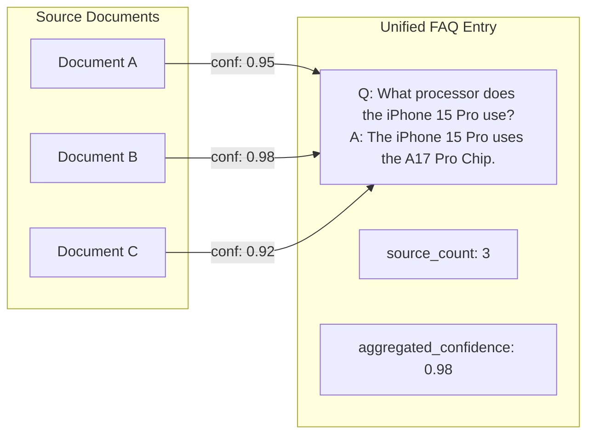
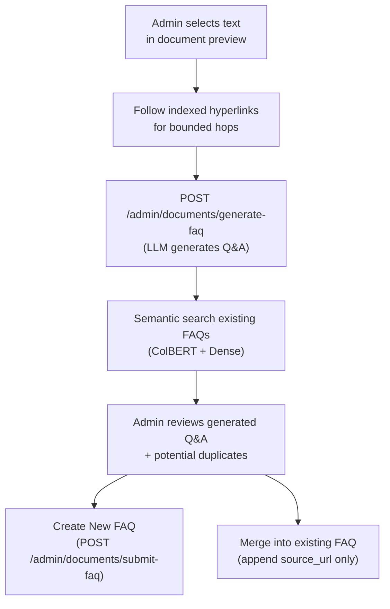
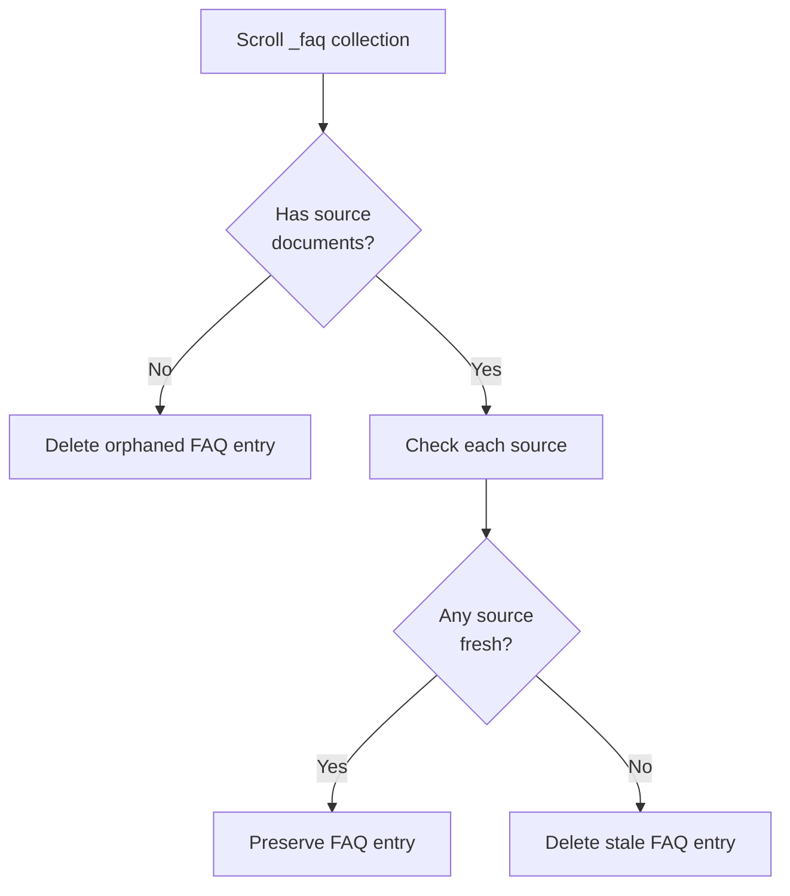

# FAQ Knowledge Base

## FAQ Entry Structure

FAQ entries store question/answer pairs with source provenance:

```json
{
  "id": "uuid",
  "question": "What is the memory bandwidth of the NVIDIA H200?",
  "answer": "The NVIDIA H200 GPU has a memory bandwidth of 4.8 TB/s.",
  "source_documents": [
    {
      "document_id": "doc123",
      "url": "https://example.com/h200-specs",
      "confidence": 0.95
    }
  ],
  "source_count": 1,
  "aggregated_confidence": 0.95,
  "first_seen": "2024-01-15T00:00:00Z",
  "last_updated": "2024-01-15T00:00:00Z",
  "score": 35.2
}
```

## FAQ Text Generation

Each FAQ entry is embedded using the `generate_faq_text()` format:

```
Q: {question}
A: {answer}
```

This simple Q&A format is used as the text that gets embedded (ColBERT + Dense vectors) for hybrid search.

## FAQ ID Generation

FAQ IDs are generated deterministically using `generate_faq_id()`: a UUID5 hash of `"{normalized_question}|{normalized_answer}"`. This ensures that identical Q&A pairs always produce the same ID, enabling automatic merge detection.

## FAQ Extraction

FAQ extraction from text is handled by the separate **fact-ingestion** service (`services/fact-ingestion/`), not by the qdrant-proxy. The qdrant-proxy provides MCP tools for CRUD operations on FAQ entries (`create_faq_entry`, `search_faq_entries`, etc.), while the fact-ingestion service handles the LLM-based extraction workflow.

## Indexed Document Graph Traversal

Indexed documents may contain `hyperlinks`, and FAQ entries already keep `source_documents`. The proxy now uses those two relationships as a lightweight knowledge graph:

- **FAQ -> source document** via `source_documents[].document_id` / `url`
- **document -> linked document** via indexed `hyperlinks`

Traversal is bounded and only follows links that already resolve to document IDs in the same Qdrant collection. The proxy does **not** fetch remote URLs during traversal.

## Multi-Source FAQ Tracking

FAQ entries can accumulate evidence from multiple documents:



## MCP FAQ Tools

> FAQ operations are exclusively via MCP tools. The admin UI uses a JavaScript MCP client to call these tools directly.

| MCP Tool | Description |
|----------|-------------|
| `create_faq_entry` | Create single FAQ entry (with merge detection) |
| `get_faq_entry` | Get FAQ entry by ID |
| `delete_faq_entry` | Delete FAQ entry |
| `search_faq_entries` | Hybrid search over FAQ entries |
| `add_source_to_faq_entry` | Add source URL to existing FAQ entry |
| `remove_source_from_faq_entry` | Remove source (auto-deletes if empty) |
| `remove_url_from_all_faqs` | Batch cleanup when document deleted |

See [MCP Tools](mcp-tools.md) for full parameter details.

## Admin FAQ Generation from Documents

The admin UI provides a manual FAQ generation workflow where administrators can select text from indexed documents and have an LLM generate question-answer pairs.



### Generate FAQ Request

```json
{
  "selected_text": "The library is open Monday to Friday from 8:00 to 16:00.",
  "source_url": "https://example.com/hours",
  "document_id": "uuid-of-document",
  "collection_name": "my-collection",
  "follow_links": true,
  "max_hops": 1,
  "max_linked_documents": 3
}
```

### Generate FAQ Response

```json
{
  "question": "What are the library's opening hours?",
  "answer": "The library is open Monday to Friday from 8:00 to 16:00.",
  "supporting_documents": [
    {
      "doc_id": "linked-doc-uuid",
      "url": "https://example.com/contact",
      "title": "Library Contact",
      "hop_count": 1,
      "via_url": "https://example.com/hours",
      "content_preview": "..."
    }
  ],
  "duplicates": [
    {
      "id": "existing-faq-uuid",
      "question": "When is the library open?",
      "answer": "Monday to Friday, 8:00–16:00.",
      "score": 35.2,
      "source_documents": ["..."],
      "source_count": 2
    }
  ]
}
```

When `follow_links` is enabled, the selected excerpt remains the primary source of truth. Supporting linked documents are additional context only.

### Submit FAQ (Create New)

```json
{
  "question": "What are the library's opening hours?",
  "answer": "The library is open Monday to Friday from 8:00 to 16:00.",
  "source_url": "https://example.com/hours",
  "document_id": "uuid-of-document",
  "collection_name": "my-collection"
}
```

### Submit FAQ (Merge into Existing)

```json
{
  "question": "...",
  "answer": "...",
  "source_url": "https://example.com/hours",
  "document_id": "uuid-of-document",
  "collection_name": "my-collection",
  "merge_with_id": "existing-faq-uuid"
}
```

When merging, only the `source_url` and `document_id` are appended to the existing FAQ's `source_documents` list — the question and answer remain unchanged.

## Triggerable FAQ Agent Runs

The proxy now supports a background **agentic** FAQ run. For each source document, the model can decide just in time whether to:

1. issue a custom semantic search
2. inspect one of the returned documents
3. follow a specific indexed hyperlink
4. stop retrieval and generate FAQs from the gathered evidence

Only documents the agent actually inspects are used as support and queued later in the same run.
`max_linked_documents` now acts as the total supporting-document budget per source document, regardless of whether those documents came from hyperlink hops or custom searches.

### Start a Run

```
POST /admin/faq-agent/runs
Authorization: Bearer <QDRANT_PROXY_ADMIN_KEY>
```

```json
{
  "collection_name": "my-collection",
  "limit_documents": 50,
  "follow_links": true,
  "max_hops": 1,
  "max_linked_documents": 3,
  "max_retrieval_steps": 6,
  "max_search_queries": 2,
  "max_search_results": 5,
  "max_faqs_per_document": 3,
  "force_reprocess": false,
  "remove_stale_faqs": true
}
```

### Poll Run Status

```
GET /admin/faq-agent/runs/{run_id}
Authorization: Bearer <QDRANT_PROXY_ADMIN_KEY>
```

### Stop a Run

```
POST /admin/faq-agent/runs/{run_id}/stop
Authorization: Bearer <QDRANT_PROXY_ADMIN_KEY>
```

Stopping is cooperative: the run is marked as `stopping` / `cancel_requested`, then exits cleanly and becomes `cancelled`.

Typical status fields:

- `documents_processed`, `documents_skipped`, `documents_failed`
- `faqs_created`, `faqs_merged`, `faqs_refreshed`
- `faqs_reassigned`, `faqs_removed_sources`, `faqs_deleted`
- `retrieval_steps`, `search_queries`, `supporting_documents_inspected`
- `cancel_requested`, `handled_document_ids`, and `recent_documents`

### Per-Document Processing Marker

Each processed document gets a `metadata.faq_agent` marker so future runs can skip unchanged documents unless `force_reprocess` is enabled.

```json
{
  "faq_agent": {
    "last_run_id": "run-uuid",
    "last_processed_at": "2026-04-23T15:00:00+00:00",
    "content_hash": "sha256...",
    "status": "processed",
    "reason": "faq_generation_complete",
    "stats": {
      "retrieval_steps": 4,
      "search_queries": 1,
      "supporting_document_count": 2,
      "link_follow_count": 1,
      "finish_reason": "agent_finished",
      "generated_faq_count": 3,
      "faqs_created": 2,
      "faqs_merged": 1
    },
    "supporting_document_ids": ["linked-doc-1", "linked-doc-2"]
  }
}
```

Within one run, only documents actually fetched by the agent are queued once and not processed again if they are encountered later in the same run.

## Agentic Knowledge Retrieval via MCP

`search_knowledge_base` can now optionally return `related_documents` gathered by following indexed hyperlinks from:

1. matched search documents
2. documents referenced by matched FAQ entries

This allows LLM clients to do bounded multi-hop retrieval over already indexed content without leaving the knowledge base.

## FAQ / KV Store

### KV Collection Schema

KV collections use the same dual-vector schema as the main document collections:

```python
vectors_config = {
    "colbert": VectorParams(size=128, distance=Cosine, multivector_config=MaxSim),
    "dense": VectorParams(size=1024, distance=Cosine),
}
```

**Search pipeline**: Dense prefetch → ColBERT MaxSim reranking.

### Admin UI: FAQ / KV Tab

The admin UI includes a dedicated **FAQ / KV** tab with:

- **Collection dropdown** — Lists all KV collections with entry counts; auto-refreshes
- **Create collection** — Input field to create a new KV collection on the fly
- **CRUD interface** — List all entries, create new entries, edit existing entries (modal form), delete entries with confirmation
- **Semantic search** — Search across FAQ entries using the triple-vector pipeline with configurable score threshold
- **Search result feedback** — Each search result shows 👍/👎 binary buttons and ★1–5 star ranking; stored in per-collection feedback collections (`kv_{name}_feedback`) for embedding fine-tuning via contrastive export

## FAQ Entry Garbage Collection

The `/admin/gc/facts` endpoint removes orphaned FAQ entries whose source documents are stale.

### Request

```
POST /admin/gc/facts?collection_name=my-collection&max_age_days=30&dry_run=true
Authorization: Bearer <QDRANT_PROXY_ADMIN_KEY>
```

### Parameters

| Parameter | Type | Default | Description |
|-----------|------|---------|-------------|
| `collection_name` | string | `my-collection` | Base collection name |
| `max_age_days` | int | 30 | Maximum age in days |
| `dry_run` | bool | true | Preview only, don't delete |

### Logic



### Response

```json
{
  "collection": "my-collection_faq",
  "status": "completed",
  "cutoff_date": "2026-01-01T00:00:00+00:00",
  "max_age_days": 30,
  "facts_checked": 1250,
  "facts_deleted": 45,
  "facts_preserved": 1180,
  "facts_orphaned": 25,
  "errors": 0
}
```
