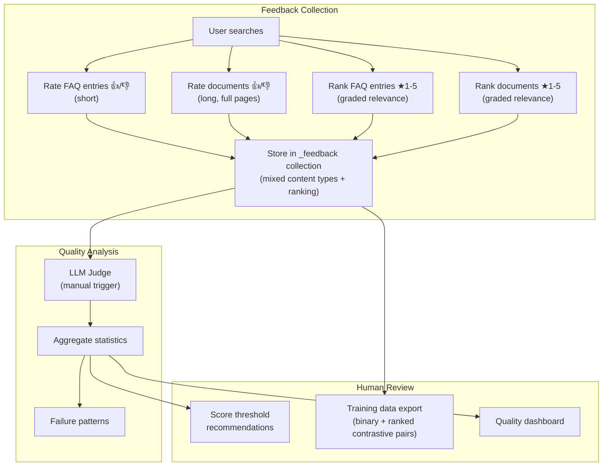
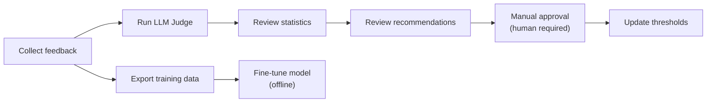

# Search Quality Feedback System

The feedback system collects user ratings on search result relevance for **both FAQ entries and documents**, enabling mixed training data with short FAQ entries and long pages. It supports **binary labelling** (thumbs up/down) and **relative ranking scores** (1–5 stars). The system runs LLM-based quality assessment and produces training data for model fine-tuning. **All system changes require human review** — no automatic threshold adjustments.

## Key Features

- **Mixed Content Types**: Support for both short FAQ entries and full document feedback
- **Unified Storage**: Both types stored in same collection for easy comparison
- **Binary + Ranked Feedback**: Thumbs up/down for relevance AND 1–5 star ranking for graded relevance
- **Ranked Contrastive Pairs**: Higher-ranked results serve as positives against lower-ranked results for the same query
- **Rich Training Data**: Generate contrastive pairs from both binary labels and ranking score differences
- **Quality Analysis**: LLM-based relevance assessment and pattern detection

## Architecture



## Feedback Collection Schema

### Common Fields

| Field | Type | Description |
|-------|------|-------------|
| `id` | string | UUID of feedback record |
| `query` | string | Original search query |
| `search_score` | float | Score from search at rating time |
| `user_rating` | int | 1 (relevant), 0 (neutral), -1 (irrelevant) |
| `ranking_score` | int (optional) | 1–5 relative ranking score for graded relevance |
| `rating_session_id` | string (optional) | Session/run ID that scopes relative star labels to one search session |
| `content_type` | string | "faq" or "document" |
| `created_at` | datetime | When feedback was submitted |

### FAQ-Specific Fields (`content_type="faq"`)

| Field | Type | Description |
|-------|------|-------------|
| `faq_id` | string | ID of rated FAQ entry |
| `faq_text` | string | Full FAQ text for training |

### Document-Specific Fields (`content_type="document"`)

| Field | Type | Description |
|-------|------|-------------|
| `doc_id` | string | ID of rated document |
| `doc_url` | string | URL of document |
| `doc_content` | string | Full document content (long) |

### Collection Naming

Feedback collections follow the pattern: `{collection}_feedback` (e.g., `my-collection_feedback`).

## API Endpoints

| Method | Endpoint | Description |
|--------|----------|-------------|
| `POST` | `/feedback` | Submit user feedback (FAQ or document) |
| `GET` | `/admin/feedback` | List feedback records with filters |
| `GET` | `/admin/feedback/stats` | Quality metrics + recommendations |
| `GET` | `/admin/feedback/export` | Export training data |
| `DELETE` | `/admin/feedback/{id}` | Delete feedback record |
| `POST` | `/admin/feedback/judge` | Trigger LLM quality assessment |

### POST /feedback

**FAQ Feedback Example (with ranking):**
```json
{
  "query": "h200 vram gpu nvidia",
  "rating_session_id": "search-1741101000000-ab12cd34",
  "faq_id": "faq_123",
  "faq_text": "NVIDIA H200 GPU has 141GB HBM3e VRAM.",
  "search_score": 29.5,
  "user_rating": 1,
  "ranking_score": 5,
  "content_type": "faq",
  "collection_name": "my-collection"
}
```

**Document Feedback Example:**
```json
{
  "query": "h200 vram gpu nvidia",
  "rating_session_id": "search-1741101000000-ab12cd34",
  "doc_id": "doc_nvidia_h200_specs",
  "doc_url": "https://nvidia.com/h200-specs",
  "doc_content": "The NVIDIA H200 Tensor Core GPU delivers exceptional performance...",
  "search_score": 31.2,
  "user_rating": 1,
  "content_type": "document",
  "collection_name": "my-collection"
}
```

### GET /admin/feedback/stats

Returns aggregated quality metrics:

```json
{
  "total_feedback": 150,
  "positive_feedback": 95,
  "neutral_feedback": 10,
  "negative_feedback": 45,
  "score_threshold_recommendations": [
    {
      "type": "threshold_suggestion",
      "message": "Consider raising FAQ score threshold above 25.3",
      "rationale": "12 false positives found with scores >= 25.3",
      "requires_human_approval": true
    }
  ],
  "common_failure_patterns": [
    {
      "pattern": "Broad queries returning loosely related FAQ entries",
      "occurrences": 5,
      "suggestion": "Consider adding entity type constraints for domain-specific queries"
    }
  ]
}
```

### POST /admin/feedback/judge

Manually trigger LLM quality assessment on pending feedback records.

```json
// Request
{"collection_name": "my-collection", "limit": 100}

// Response
{
  "records_judged": 25,
  "records_failed": 2,
  "avg_relevance_score": 0.68,
  "false_positives_found": 5,
  "recommendations": [
    "Consider stricter entity type matching for domain-specific queries"
  ]
}
```

### GET /admin/feedback/export

Export feedback data for model fine-tuning.

**Parameters:**
- `format`: `contrastive` (triplets) or `jsonl` (flat records)
- `collection_name`: Optional collection filter
- `rating_session_id`: Optional rating-session filter

Contrastive pairing is built within `(query, rating_session_id)` buckets. This prevents old ratings from one index state being paired with ratings from later index states.

**Contrastive Format Response:**
```json
{
  "total_records": 100,
  "positive_pairs": 60,
  "negative_pairs": 40,
  "contrastive_pairs": 92,
  "binary_pairs": 80,
  "ranked_pairs": 12,
  "data": [
    {
      "query": "h200 vram gpu nvidia",
      "positive": "NVIDIA H200 GPU has 141GB HBM3e VRAM.",
      "negative": "Intel Arc A770 has 16GB GDDR6 memory.",
      "positive_type": "faq",
      "negative_type": "faq",
      "pair_source": "binary",
      "score_gap": null
    },
    {
      "query": "h200 specifications",
      "positive": "The NVIDIA H200 Tensor Core GPU delivers exceptional performance...",
      "negative": "NVIDIA H200 is available for data centers.",
      "positive_type": "document",
      "negative_type": "faq",
      "pair_source": "ranked",
      "score_gap": 2
    }
  ]
}
```

**Pair Sources:**
- `binary`: Generated from thumbs up vs thumbs down (positive × negative combinations)
- `ranked`: Generated from ranking score differences within same query (higher rank = positive, lower rank = negative)

## Mixed Feedback Benefits

- **FAQ-to-FAQ pairs**: Short, precise contrastive learning
- **Document-to-Document pairs**: Long-form semantic understanding
- **Cross-type pairs**: Learn that both short and long relevant content should rank high
- **Ranked pairs**: Use "good" results as hard negatives against "very good" results
- **Focused combinations**: Binary pairs for thumbs-only feedback, plus ranked pairs that prefer adjacent scores within the same query (`5→4`, `4→3`, `3→2`, `2→1`) and fall back to `5→3` when a query has no 4-star feedback

## Admin UI: Quality Tab

The Quality Feedback tab includes:

1. **Statistics Cards**: Total feedback, pending LLM judge, positive/negative counts, false positive rate
2. **Recommendations Panel**: Score threshold suggestions (requires human approval)
3. **Failure Patterns**: Common mismatch patterns detected
4. **LLM Judge Trigger**: Manual button to run quality assessment
5. **Feedback List**: Browsable list with filters
6. **Export Section**: Download training data in JSONL format

### Feedback Buttons on FAQ Entries

Each search result displays:
- 👍 Mark as relevant / 👎 Mark as irrelevant
- ★ to ★★★★★ Rank relative relevance (1–5)

Ranking assigns a `ranking_score` and auto-maps to binary `user_rating` (1–2 → irrelevant, 3 → neutral, 4–5 → relevant).

### Feedback Buttons on Documents

Document results support the same feedback buttons. If a document result does not include an explicit `doc_id`, the UI derives one from the URL using UUIDv5 with the standard DNS namespace (same algorithm as `url_to_doc_id()` in `services/facts.py`). The UI prefers WebCrypto for SHA-1, but falls back to a built-in SHA-1 implementation for non-secure contexts (HTTP).

## Human Review Workflow



**Critical**: The system explicitly does NOT auto-adjust thresholds. All recommendations are surfaced in the dashboard for human review and manual action.

## Training Data Formats

**Contrastive Triplets** (for contrastive learning):
```
query, positive_faq, negative_faq
```

**JSONL Records** (for supervised fine-tuning):
```jsonl
{"query": "...", "faq": "...", "label": 1, "score": 0.95}
{"query": "...", "faq": "...", "label": 0, "score": 0.23}
```
