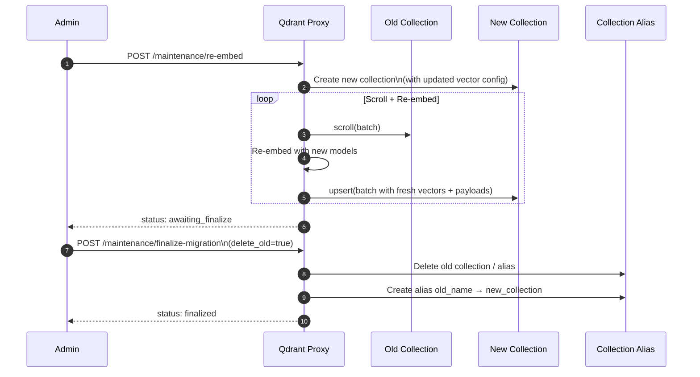
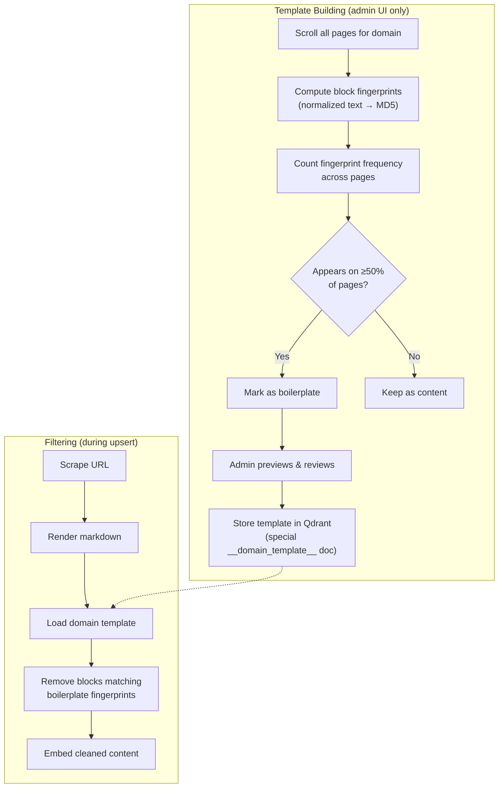

# Maintenance

## Blue-Green Embedding Migration

Re-embedding follows the [Qdrant-recommended migration pattern](https://qdrant.tech/documentation/tutorials-operations/embedding-model-migration/) for zero-downtime model switching:



### Step-by-Step Workflow

1. **Update models** (optional): Update `DENSE_MODEL_NAME`, `COLBERT_MODEL_NAME`, `DENSE_EMBEDDING_URL`, and `COLBERT_EMBEDDING_URL` environment variables and restart the service. The dense vector dimension is auto-detected from the endpoint.

2. **Start migration**: `POST /admin/maintenance/re-embed` — creates a NEW collection `{name}_migration_{timestamp}` with the current model config's vector dimensions, then scrolls the old collection in batches, re-embeds every point with the current models, and upserts complete points (vectors + payloads) into the new collection.

3. **Poll status**: `GET /admin/maintenance/status` — returns progress for all tasks. Wait for `status: "awaiting_finalize"`.

4. **Finalize**: `POST /admin/maintenance/finalize-migration` with `{"collection_name": "...", "delete_old": true}` — atomically swaps a Qdrant collection alias so all existing code referencing the old collection name transparently reads from the new one. If `delete_old=true`, the old backing collection is deleted.

### Key Benefits

- **Zero downtime**: Searches keep using the old collection until the alias swap
- **Atomic cutover**: Alias swap is instantaneous
- **Safe rollback**: Old collection can be kept (set `delete_old=false`) for rollback
- **Clean state**: New collection has consistent vectors from the same model version
- **Resume-safe**: If migration fails, the incomplete target collection is cleaned up automatically
- **Alias-aware**: When re-embedding a collection behind an alias, the alias is automatically detected and moved to point to the new collection

### Selective Re-Embedding

The re-embedding tool supports selective processing of specific vector types. It automatically detects collection types and extracts the appropriate text for embedding:

- **Document collections**: uses `content` payload field
- **FAQ collections** (`*_faq`): uses `generate_faq_text()` format ("Q: {question}\nA: {answer}")
- **KV collections** (`kv_*`): uses `Key: {key}\nValue: {value}` format

| Parameter | Type | Default | Description |
|-----------|------|---------|-------------|
| `collection_name` | string | None | Specific collection to re-embed, or omit for all |
| `batch_size` | int | 8 | Documents per batch |
| `vector_types` | list[string] | `["dense", "colbert", "sparse"]` | Types to include |

Migration collections (`_migration_`) and feedback collections (`*_feedback`) are automatically excluded when processing all collections.

### Example: Re-embed a Collection

```bash
# 1. Start blue-green migration
curl -X POST "http://qdrant-proxy:8002/admin/maintenance/re-embed" \
  -H "Authorization: Bearer $ADMIN_KEY" \
  -H "Content-Type: application/json" \
  -d '{
    "collection_name": "my_collection",
    "vector_types": ["dense", "colbert", "sparse"]
  }'

# 2. Poll status until awaiting_finalize
curl "http://qdrant-proxy:8002/admin/maintenance/status" \
  -H "Authorization: Bearer $ADMIN_KEY"

# 3. Finalize: swap alias and delete old collection
curl -X POST "http://qdrant-proxy:8002/admin/maintenance/finalize-migration" \
  -H "Authorization: Bearer $ADMIN_KEY" \
  -H "Content-Type: application/json" \
  -d '{"collection_name": "my_collection", "delete_old": true}'
```

## Embedding Model Configuration

Embedding model IDs are stored persistently in a dedicated Qdrant collection called `system_config`. This ensures that configuration is shared across all proxy nodes and survives restarts.

| Setting | Default | Description |
|---------|---------|-------------|
| `colbert_model_id` | `VAGOsolutions/SauerkrautLM-Multi-ModernColBERT` | ColBERT model served by vLLM (env: `COLBERT_MODEL_NAME`) |
| `dense_model_id` | `Qwen/Qwen3-Embedding-0.6B` | Dense model ID served by vLLM (env: `DENSE_MODEL_NAME`) |
| `dense_vector_size` | (auto-detected) | Auto-detected from OpenAI-compatible endpoint at startup |

Updates to these settings via the API are saved to Qdrant. The dense vector dimension is automatically probed from the embedding endpoint during model initialization.

---

## Template Learning (Boilerplate Detection)

The template learning system identifies and filters repeating boilerplate content (e.g., cookie banners, navigation text, footer disclaimers) across pages of the same domain. Templates are **only** built via the admin UI after manual review — there is no automatic template generation.

### How It Works



### Fingerprinting

Each markdown block is fingerprinted by:
1. Stripping heading markers (`# `), list markers (`- `, `1. `)
2. Replacing markdown links with just their display text
3. Replacing digit sequences with a placeholder (`0`) so template strings with variable numbers (e.g. "Es wurden 13 Dienstleistungen gefunden" vs "Es wurden 16 Dienstleistungen gefunden") collapse to the same fingerprint
4. Collapsing whitespace and lowercasing
5. Taking the first 12 chars of the MD5 hash

Blocks shorter than 5 characters after normalization are skipped.

### Template Building

```bash
curl -X POST "http://qdrant-proxy:8002/admin/templates/build?domain=example.com&threshold=0.5&min_pages=5" \
  -H "Authorization: Bearer $ADMIN_KEY"
```

| Parameter | Type | Default | Description |
|-----------|------|---------|-------------|
| `domain` | string | required | Domain to analyse |
| `threshold` | float | 0.5 | Min fraction of pages a block must appear on |
| `min_pages` | int | 5 | Min pages required |
| `scroll_limit` | int | 2000 | Max pages to sample |
| `collection_name` | string | main collection | Collection to scan |

Templates are **only** built via the admin UI (`/admin` → Maintenance → Template Learning) after manual review.

### Preview (Dry-Run)

Before committing a template, admins can preview which blocks would be classified as boilerplate:

```bash
curl "http://qdrant-proxy:8002/admin/templates/preview?domain=example.com&threshold=0.5&sample_count=3&scroll_limit=2000" \
  -H "Authorization: Bearer $ADMIN_KEY"
```

Returns boilerplate fingerprints, human-readable block text, and `samples[]` each with `url`, `before_content`, `after_content`, `before_length`, `after_length`, and `blocks_removed`. Nothing is stored.

### Reapply Template to Existing Documents

After building or updating a template, reapply it retroactively to all existing documents for the domain:

```bash
curl -X POST "http://qdrant-proxy:8002/admin/templates/reapply?domain=example.com&scroll_limit=5000" \
  -H "Authorization: Bearer $ADMIN_KEY"
```

Runs as a background task — check `/admin/maintenance/status` for progress. Each document's `raw_content` field is used as the source; documents without `raw_content` fall back to their current `content`.

### Domain Discovery

List all unique domains in a collection with page counts:

```bash
curl "http://qdrant-proxy:8002/admin/templates/domains?collection_name=my_collection&scroll_limit=10000" \
  -H "Authorization: Bearer $ADMIN_KEY"
```

### Template Storage

Templates are stored as special documents in the same collection:
- URL: `__domain_template__example.com`
- ID: deterministic UUID5 from the URL
- Zero vectors (metadata-only, won't appear in search)
- Not affected by garbage collection (no `metadata.indexed_at`)

### Automatic Filtering During Ingestion

During `upsert_document_logic`, if a domain template exists:
1. The domain is extracted from the URL
2. The raw Docling markdown is preserved as `raw_content` in the payload
3. The template's boilerplate fingerprints are loaded
4. Markdown blocks matching boilerplate fingerprints are removed
5. Only the cleaned content is embedded and stored as `content`

### Admin UI (Maintenance Tab)

The Maintenance tab includes a **Template Learning** card:
1. **Domain dropdown** — auto-populated from the collection via the domains endpoint
2. **Threshold / Min Pages** controls for tuning sensitivity
3. **Preview button** — runs dry-run analysis (required before building)
4. **Build button** — commits the template after preview review (human approval required)
5. **Existing templates list** with reapply and delete capabilities

---

## Document Garbage Collection

The `/admin/gc/documents` endpoint removes stale documents using native Qdrant filters.

### Request

```
POST /admin/gc/documents?collection_name=my-collection&max_age_days=30&pdf_max_age_days=365&dry_run=false
Authorization: Bearer <QDRANT_PROXY_ADMIN_KEY>
```

### Parameters

| Parameter | Type | Default | Description |
|-----------|------|---------|-------------|
| `collection_name` | string | `my-collection` | Collection name |
| `max_age_days` | int | 30 | Max age for regular pages |
| `pdf_max_age_days` | int | 365 | Max age for PDF files |
| `dry_run` | bool | false | Preview only |

### Logic

Uses Qdrant's `delete` API with a combined filter:
1. Matches documents where `metadata.indexed_at < cutoff` AND the URL does **not** end in `.pdf`
2. Matches documents where `metadata.indexed_at < pdf_cutoff` AND the URL **ends** in `.pdf`

If the client model lacks `MatchRegex`, the filter falls back to `MatchText` with `.pdf`.
