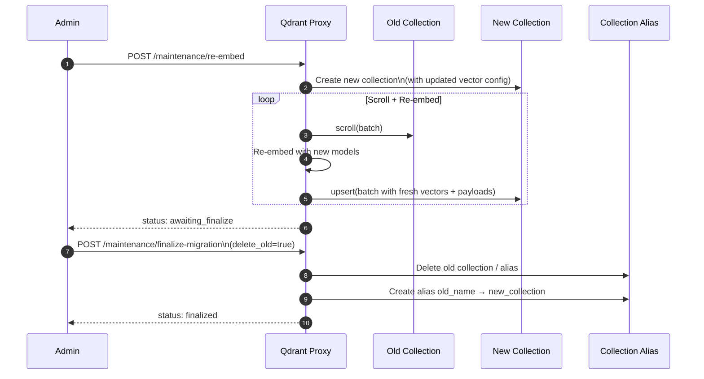

# Maintenance

## Blue-Green Embedding Migration

Re-embedding follows the [Qdrant-recommended migration pattern](https://qdrant.tech/documentation/tutorials-operations/embedding-model-migration/) for zero-downtime model switching:



### Step-by-Step Workflow

1. **Update models** (optional): Update `DENSE_MODEL_NAME`, `COLBERT_MODEL_NAME`, `DENSE_EMBEDDING_URL`, and `COLBERT_EMBEDDING_URL` environment variables and restart the service. The dense vector dimension is auto-detected from the endpoint.

2. **Start migration**: `POST /admin/maintenance/re-embed` — creates a NEW collection `{name}_migration_{timestamp}` with the current model config's vector dimensions, then scrolls the old collection in batches, re-embeds every point with the current models, and upserts complete points (vectors + payloads) into the new collection.

3. **Poll status**: `GET /admin/maintenance/status` — returns progress for all tasks. Wait for `status: "awaiting_finalize"`.

4. **Finalize**: `POST /admin/maintenance/finalize-migration` with `{"collection_name": "...", "delete_old": true}` — atomically swaps a Qdrant collection alias so all existing code referencing the old collection name transparently reads from the new one. If `delete_old=true`, the old backing collection is deleted.

### Key Benefits

- **Zero downtime**: Searches keep using the old collection until the alias swap
- **Atomic cutover**: Alias swap is instantaneous
- **Safe rollback**: Old collection can be kept (set `delete_old=false`) for rollback
- **Clean state**: New collection has consistent vectors from the same model version
- **Resume-safe**: If migration fails, the incomplete target collection is cleaned up automatically
- **Alias-aware**: When re-embedding a collection behind an alias, the alias is automatically detected and moved to point to the new collection
- **Oversize retry**: Dense embedding requests that exceed the model context window retry once with the text truncated to the endpoint-reported token limit, expressed as the same number of characters

### Selective Re-Embedding

The re-embedding tool supports selective processing of specific vector types. It automatically detects collection types and extracts the appropriate text for embedding:

- **Document collections**: uses `content` payload field
- **FAQ collections** (`*_faq`): uses `generate_faq_text()` format ("Q: {question}\nA: {answer}")
- **KV collections** (`kv_*`): uses `Key: {key}\nValue: {value}` format

| Parameter | Type | Default | Description |
|-----------|------|---------|-------------|
| `collection_name` | string | None | Specific collection to re-embed, or omit for all |
| `batch_size` | int | 8 | Documents per batch |
| `vector_types` | list[string] | `["dense", "colbert", "sparse"]` | Types to include |

Migration collections (`_migration_`) and feedback collections (`*_feedback`) are automatically excluded when processing all collections.
Synthetic dense-only collections such as feedback stores and the replay query queue are recreated with placeholder vectors when the dense dimension changes; they do not need semantic re-embedding.

### Example: Re-embed a Collection

```bash
# 1. Start blue-green migration
curl -X POST "http://qdrant-proxy:8002/admin/maintenance/re-embed" \
  -H "Authorization: Bearer $ADMIN_KEY" \
  -H "Content-Type: application/json" \
  -d '{
    "collection_name": "my_collection",
    "vector_types": ["dense", "colbert", "sparse"]
  }'

# 2. Poll status until awaiting_finalize
curl "http://qdrant-proxy:8002/admin/maintenance/status" \
  -H "Authorization: Bearer $ADMIN_KEY"

# 3. Finalize: swap alias and delete old collection
curl -X POST "http://qdrant-proxy:8002/admin/maintenance/finalize-migration" \
  -H "Authorization: Bearer $ADMIN_KEY" \
  -H "Content-Type: application/json" \
  -d '{"collection_name": "my_collection", "delete_old": true}'
```

## Embedding Model Configuration

Embedding model IDs are stored persistently in a dedicated Qdrant collection called `system_config`. This ensures that configuration is shared across all proxy nodes and survives restarts.

| Setting | Default | Description |
|---------|---------|-------------|
| `colbert_model_id` | `VAGOsolutions/SauerkrautLM-Multi-ModernColBERT` | ColBERT model served by vLLM (env: `COLBERT_MODEL_NAME`) |
| `dense_model_id` | `Qwen/Qwen3-Embedding-4B` | Dense model ID served by vLLM (env: `DENSE_MODEL_NAME`) |
| `dense_vector_size` | (auto-detected) | Auto-detected from OpenAI-compatible endpoint at startup |

Updates to these settings via the API are saved to Qdrant. The dense vector dimension is automatically probed from the embedding endpoint during model initialization.

---

## Document Garbage Collection

The `/admin/gc/documents` endpoint removes stale documents using native Qdrant filters.

### Request

```
POST /admin/gc/documents?collection_name=my-collection&max_age_days=30&pdf_max_age_days=365&dry_run=false
Authorization: Bearer <QDRANT_PROXY_ADMIN_KEY>
```

### Parameters

| Parameter | Type | Default | Description |
|-----------|------|---------|-------------|
| `collection_name` | string | `my-collection` | Collection name |
| `max_age_days` | int | 30 | Max age for regular pages |
| `pdf_max_age_days` | int | 365 | Max age for PDF files |
| `dry_run` | bool | false | Preview only |

### Logic

Uses Qdrant's `delete` API with a combined filter:
1. Matches documents where `metadata.indexed_at < cutoff` AND the URL does **not** end in `.pdf`
2. Matches documents where `metadata.indexed_at < pdf_cutoff` AND the URL **ends** in `.pdf`

If the client model lacks `MatchRegex`, the filter falls back to `MatchText` with `.pdf`.
