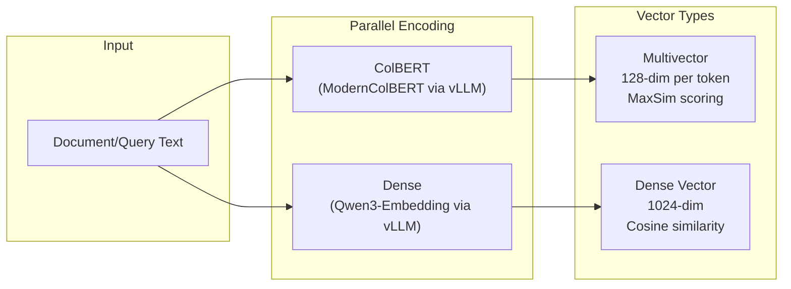
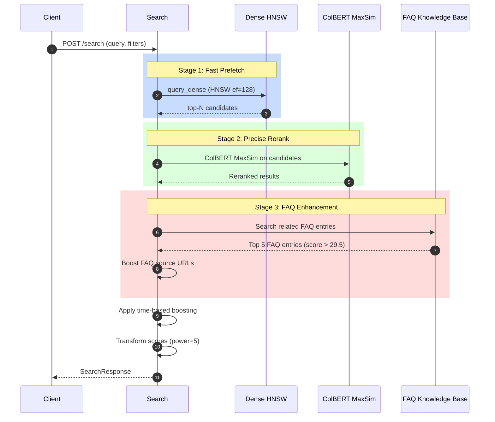
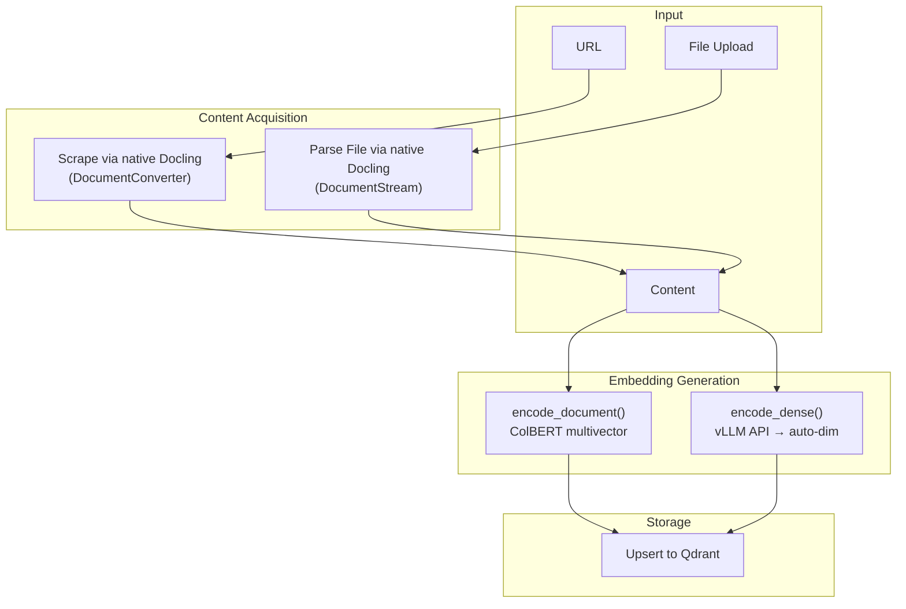

# Search Pipeline

## Dual-Vector Embedding Strategy



### Collection Schema

```python
vectors_config = {
    "colbert": VectorParams(
        size=128, 
        multivector_config=MaxSim,
        distance=Cosine
    ),
    "dense": VectorParams(
        size=1024, 
        distance=Cosine
    )
}
```

## Hybrid Search Flow



### Time-Based Boosting Formula

```
score = original_score + exp_decay(current_time - doc_time)
```

Parameters:
- `scale_days`: Default 1 day
- `midpoint`: Default 0.5
- `datetime_field`: `metadata.indexed_at`

## Document Ingestion Flow



## Docling Integration

Docling is integrated natively as a Python library using `DocumentConverter`. The converter runs in-process with GPU acceleration and produces a `DoclingDocument` which is exported to a dict via `export_to_dict()`.

### File Type Handling

- **Plain-text formats** (`.txt`, `.csv`, `.json`, `.md`, `.yaml`, `.py`, `.js`, etc.) — detected by extension and read directly without Docling processing; structured formats are wrapped in code fences.
- **Binary/rich formats** (PDF, DOCX, PPTX, etc.) — processed through the full Docling pipeline.

### PDF Pipeline Options

- OCR enabled
- Accurate table structure detection
- `images_scale=2.0` for high-resolution picture rendering
- API-based picture description via `PictureDescriptionApiOptions` pointing to LiteLLM (`concurrency=4`)
- If conversion fails with picture enrichment, retries with simpler converter (no picture enrichment)

### Custom Markdown Renderer

- Keeps only `content_layer=body` nodes
- Skips low-signal captions
- Filters navigation-like lists
- Picture/chart nodes are checked before the generic text branch so VLM-generated descriptions are always emitted
- Descriptions wrapped in `[Image: ...]` brackets
- Descriptions read from `meta.description.text` (falling back to deprecated `annotations[]`)
- Post-render cleanup removes common webpage chrome (profile chips, comment UI controls, avatar markers, vote-counter lines)
- Removes alphabet-index navigation (runs of 5+ consecutive single-character blocks like A–Z filters)
- Cuts off known non-article sections (e.g., "More Articles from our Blog", "Community", "References")

### Memory Management

After every conversion, `torch.cuda.empty_cache()` and `gc.collect()` are called to prevent GPU memory leaks. All synchronous Docling operations run in threads via `asyncio.to_thread()` to avoid blocking FastAPI. A threading lock serializes converter access since the underlying models are not thread-safe.

## Enriched Document Fields

In addition to the filtered markdown, the proxy extracts three enriched fields from the raw Docling JSON document:

| Field | Description |
|-------|-------------|
| `title` | Page title from Docling's structured document — looks for `label="title"` text node in any content layer, falling back to first `section_header` |
| `hyperlinks` | All hyperlinks from the entire document (all content layers including navigation, headers, footers), resolved to absolute URLs |
| `content_hash` | SHA-256 hash of normalized markdown content (collapsed whitespace + lowercased). Used to skip duplicate content ingestion |

## Minimum Content Threshold

Documents are only stored in Qdrant if their cleaned `content` has at least `MIN_CONTENT_WORDS` words (default: `32`). Documents below the threshold are still scraped and returned to the caller, but embedding + Qdrant upsert is skipped and the response metadata includes `skipped_storage=true` and the computed `word_count`.

## Performance Optimizations

- **HNSW prefetch**: Fast approximate search before ColBERT rerank
- **Quantization rescoring**: Compressed vectors with precision recovery
- **Periodic memory cleanup**: Garbage collection every 30s
- **Background ingestion**: Web search results ingested asynchronously
- **Batch embedding**: Dense and ColBERT encoders process multiple documents per API call
- **vLLM serving**: Both ColBERT and Dense models served via vLLM for efficient GPU inference with continuous batching
